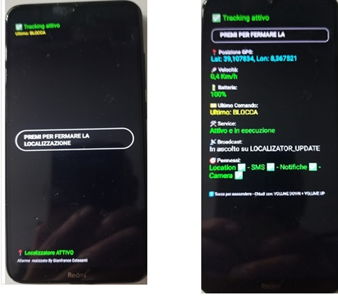
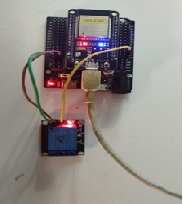
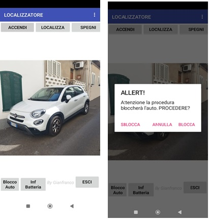

# 🚗 SAIA-IoT: Sistema Antifurto Intelligente per Autoveicoli

> **IoT & Security-by-Design PoC** | Sviluppato da **Gianfranco Colasanti**

# SISTEMA ANTIFURTO INTELLIGENTE PER AUTOVEICOLI (SAIA)

Progetto IoT sperimentale  
Autore: Gianfranco Colasanti

---

## Prefazione – Descrizione del Sistema e Principio di Funzionamento

La presente documentazione descrive in modo chiaro e tecnico il funzionamento del **SAIA**, un sistema antifurto intelligente per autoveicoli basato su tecnologie IoT, sviluppato a scopo didattico, sperimentale e di studio.

Il progetto nasce dall’esigenza di realizzare un sistema affidabile di localizzazione e allarme, evitando soluzioni commerciali chiuse e infrastrutture cloud proprietarie, privilegiando invece semplicità, controllo diretto e resilienza operativa.

Il cuore del sistema è il **localizzatore**, che non è un dispositivo dedicato, ma un **vecchio smartphone Android riciclato**, installato e nascosto all’interno del veicolo.  
Su di esso è installata un’app Android sviluppata dall’autore in **Kotlin (Android Studio)**.

---

## Architettura Generale del Sistema

Il sistema è composto da tre elementi principali:

1. **Localizzatore (Smartphone Android)**
2. **Unità di controllo ESP32 (opzionale)**
3. **Telefono personale del proprietario**

   
### App Localizzatore (Modalità Kiosk)

## 🔌 Architettura Hardware
### ESP32 con Relè Automotive

### App telefono prioritario

### Funzioni del Localizzatore

- acquisizione e gestione dei dati GPS;
- rilevamento degli spostamenti del veicolo;
- generazione degli eventi di allarme;
- comunicazione con l’ESP32 tramite Bluetooth;
- invio notifiche al proprietario tramite Telegram.

  ### 🔄 Modalità Operative (Power vs. Features)

Il sistema è stato ingegnerizzato per bilanciare autonomia energetica e capacità di difesa attiva attraverso due stati logici:

* **Modalità BACKGROUND (Efficienza Energetica):**
    * **Focus:** Massima autonomia della batteria interna (~2 giorni).
    * **Funzionamento:** L'app opera senza interfaccia visibile. Gestisce passivamente i dati GPS e rimane in ascolto del "ping" Bluetooth dall'ESP32.
    * **Limitazioni:** Interfaccia grafica disattivata per abbattere i consumi.

* **Modalità KIOSK (Difesa Attiva):**
    * **Focus:** Sicurezza e cattura dell'intruso.
    * **Funzionamento:** Attiva l'interfaccia utente in **Android Lock Task Mode**. 
    * **Feature Esclusiva:** Abilita il **"Pulsante Gabbietta"**. Se l'intruso interagisce con lo schermo cercando di fermare il sistema, viene fotografato e segnalato istantaneamente.
    * **Consumo:** Maggiore assorbimento energetico (da usare in fase critica o con alimentazione fissa).

### Unità di Controllo ESP32 (Opzionale)

L’ESP32 è incaricata della gestione della **logica di blocco motore** tramite relè o MOSFET automotive.  
È occultata nel veicolo e alimentata sotto chiave.

Il sistema può funzionare **anche senza ESP32**, limitandosi alle funzioni di localizzazione e allarme. In questa configurazione il blocco motore non è disponibile.

---

## Comunicazioni tra i Componenti

### Telefono Proprietario → Localizzatore
- **Canale:** SMS  
- **Motivazione:** garantire il funzionamento anche in assenza di connessione dati  
- **Comandi:**  
  - accensione/spegnimento GPS  
  - richiesta posizione  
  - blocco/sblocco veicolo  
  - stato batteria

I comandi SMS vengono ricevuti e **memorizzati** dal localizzatore.

### Localizzatore → ESP32
- **Canale:** Bluetooth  
- **Logica:** event-driven a basso consumo

### Localizzatore → Telefono Proprietario
- **Canale:** Telegram  
- **Contenuto:** notifiche di allarme, posizioni GPS, eventi di stato

---

## Scenario di Funzionamento – Evento di Furto

1. Il veicolo viene sottratto e inizia a muoversi.
2. Dopo uno spostamento superiore a **30 metri**, il sistema invia un messaggio Telegram **“FURTO AUTO”** con la posizione GPS.
3. Il movimento continua ad essere monitorato.
4. Dopo **2 minuti consecutivi di fermo**, viene inviato il messaggio **“AUTO FERMA”** con nuova posizione.
5. Se presente ESP32, il proprietario può inviare il comando di **blocco motore**, eseguito **solo a veicolo fermo**.

---

## Algoritmo di Rilevamento Movimento (Anti-Falso Allarme)

Per evitare falsi allarmi dovuti a deriva GPS:

- attivazione allarme:
  - velocità ≥ **0.8 m/s** (~3 km/h)
  - confermata su almeno **2 rilevazioni consecutive**
- veicolo fermo:
  - velocità ≤ **0.5 m/s**
  - per almeno **2 minuti**

---

## Protocollo Bluetooth – Single Byte Trigger

Per ridurre i consumi:

- l’ESP32 opera come **SERVER**
- il localizzatore come **CLIENT**
- all’accensione del veicolo l’ESP32 invia un **singolo byte**
- il localizzatore:
  - si risveglia
  - invia il comando memorizzato
  - torna in stato di basso consumo

---

## Persistenza Stato – EEPROM ESP32

Lo stato di blocco viene salvato in **EEPROM** per garantire:

- mantenimento dello stato anche senza alimentazione
- protezione contro distacco batteria
- comportamento coerente al riavvio

---

## Sicurezza Software – Localizzatore

### Modalità Kiosk
- interfaccia bloccata
- uscita solo tramite sequenza nascosta 

### Pulsante Trappola (in modalidà Kiosk )
- pulsante fittizio
- attiva fotocamera frontale
- invia immagine via Telegram

---

## Analisi dei Consumi Energetici

| Modalità | GPS | Consumo stimato (12h) |
|--------|-----|-----------------------|
| Background | OFF | ~3% |
| Tracking | ON | ~12% |
| UI attiva | ON | ~100% |

---

## Interfacce e Hardware

### Localizzatore – Modalità UI

### App Proprietario

### ESP32 con Relè

---

## Disclaimer – Responsabilità

Questo progetto è pubblicato **esclusivamente a scopo didattico e sperimentale**.

Il sistema **non è certificato**, né progettato per l’uso su veicoli in circolazione su strada pubblica.

L’autore:
- non incoraggia utilizzi pericolosi o illeciti
- si dissocia da usi impropri
- non si assume responsabilità per danni a persone o cose

Chi utilizza o replica il progetto lo fa **sotto la propria esclusiva responsabilità**, nel rispetto delle normative vigenti e del Codice della Strada.

---

## Uso Commerciale

Qualsiasi utilizzo **commerciale o professionale** del progetto **non è autorizzato** senza accordo esplicito con l’autore.

L’autore è aperto a **collaborazioni o trattative formali**, purché svolte in modo responsabile e conforme alla legge.

